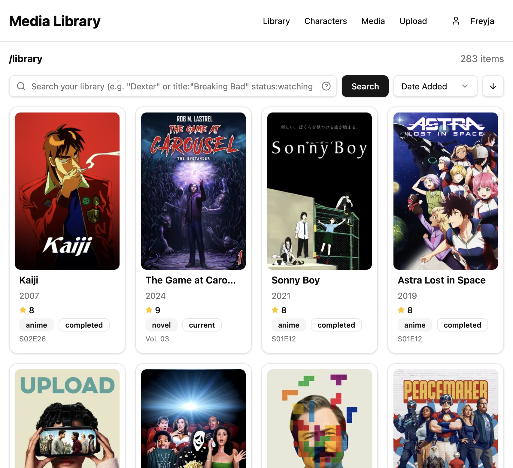
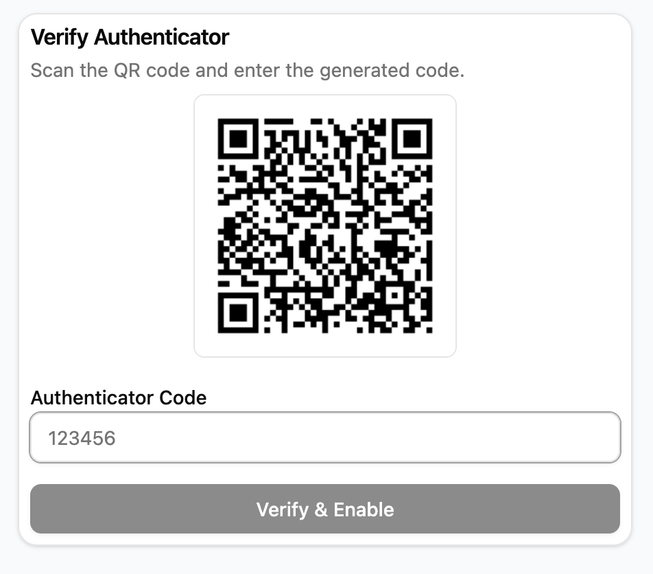

# Media Library

Self-hosted media library that lets you organize, track, and manage all your personal media in one place. Unlike relying on multiple websites or platforms, this project aims to give you full control over your media collection — whether it's movies, TV shows, music, or even obscure books. 

## Frameworks/Tools
#### Frontend:
- React (Vite)

#### Backend:
- Express
- MariaDB

## Authentication & Security



- Secure user authentication with password hashing (bcrypt)
- JWT-based session authentication
- Two-factor authentication (2FA) using TOTP (Google Authenticator / Authy compatible)
- QR code-based 2FA setup flow
- Challenge-based login flow for users with 2FA enabled
- Recovery codes for account access if TOTP device is unavailable
- Ability to enable/disable 2FA securely with re-verification

## Docker Setup

### Prerequisites
- Docker and Docker Compose installed
- Node.js (for local development)

### Quick Start

1. **Clone the repository**
```bash
git clone https://github.com/catheos/media_library.git
cd media_library
```

2. **Configure environment variables**
```bash
# Copy example env file
cp .env.docker.example .env.docker
   
# Edit .env.docker with your settings
nano .env.docker
```

3. **Build and deploy**
```bash
docker-compose --env-file .env.docker up -d --build
```

4. **Access the application**

Open `http://localhost:3000` or `http://YOUR_SERVER_IP:3000` in your browser

### Useful Commands
```bash
# View logs
docker-compose logs -f app

# Stop the application
docker-compose down

# Restart the application
docker-compose restart

# Reset database (WARNING: deletes all data)
docker-compose down -v
docker-compose up -d

# Backup database
docker-compose exec db mysqldump -u media_library -p media_library_db > backup.sql

# Enter container shell
docker-compose exec app sh
```

### Local Development (without Docker)
```bash
# Terminal 1 - Backend
cd backend
npm install
npm run dev

# Terminal 2 - Frontend
cd frontend
npm install
npm run dev
```
